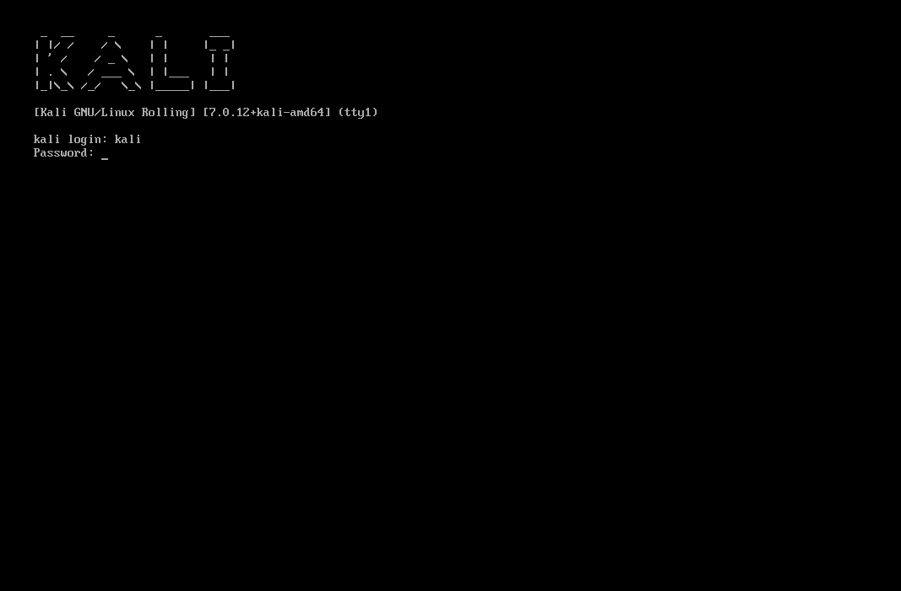
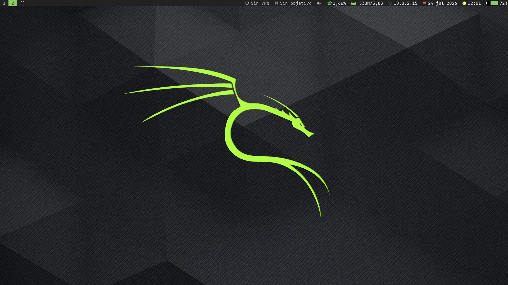
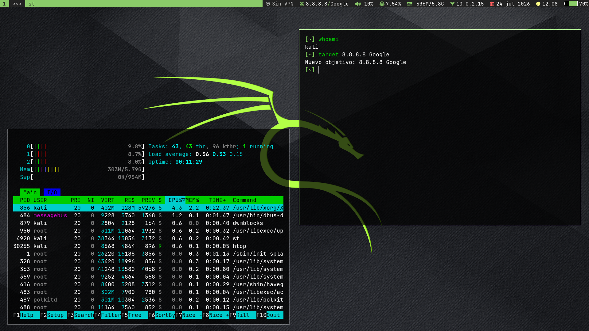
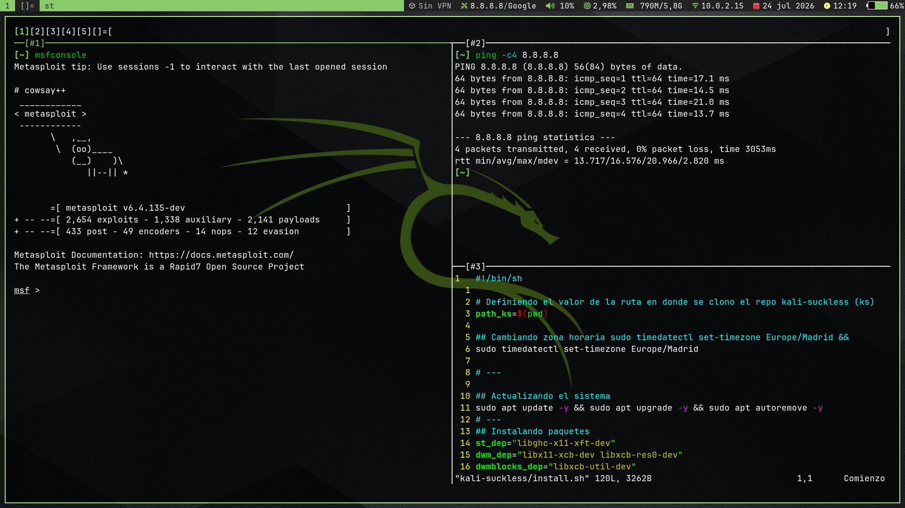

# Kali Suckless

Kali Linux con un toque suckless:

- **Gestor de ventanas:** [dwm](https://github.com/b4zh/dwm-6.8)
- **Emulador de terminal:** [st](https://github.com/b4zh/st-0.9.3)
- **Barra de estado:** [dwmblocks-async](https://github.com/b4zh/dwmblocks-scripts)
- **Shell:** bash + [ble.sh](https://github.com/akinomyoga/ble.sh)
- **Multiplexor:** [dvtm](https://www.brain-dump.org/projects/dvtm/)
- **Gestor de sesiones:** [abduco](https://www.brain-dump.org/projects/abduco/)
- **Compositor:** [xcompmgr](https://wiki.archlinux.org/title/Xcompmgr)

## install.sh
Este script descarga e instala los paquetes necesarios y configura el sistema al **idioma español**.

```bash
./install.sh
```

## dirs-update.sh
Este script cambia el nombre de los directorios predeterminados del usuario, de inglés a español.

```bash
./dirs-update.sh
```

## preview








